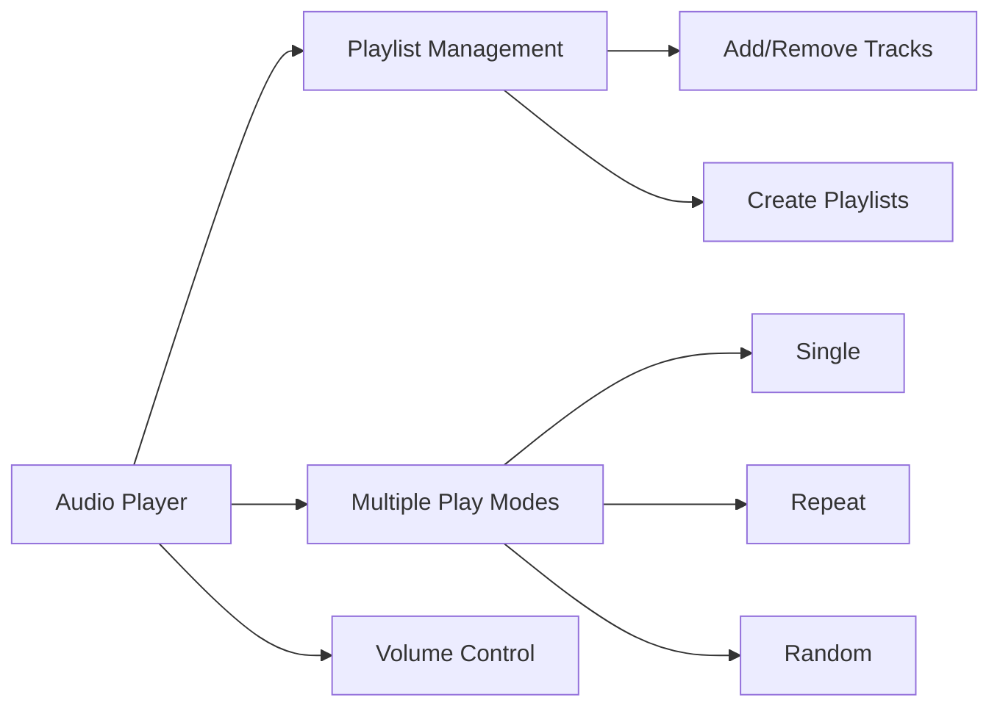
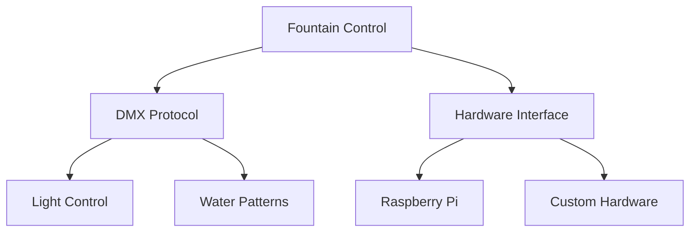
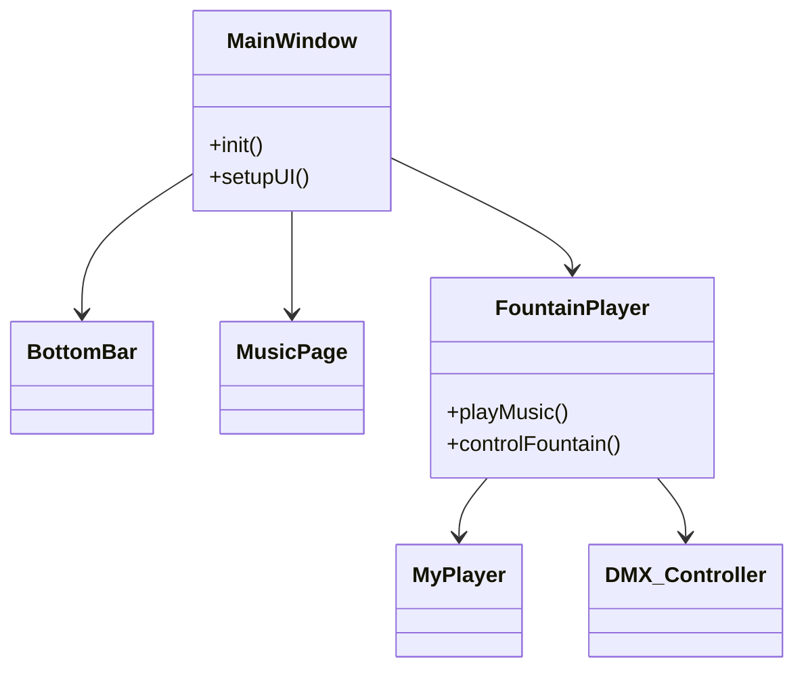

# 🎵 FountainPlayer - Music & Fountain Control System

<div align="center">
  
  
  
</div>

<p align="center">
  <h2 align="center">Modern Music Player with Fountain Control Capabilities</h2>
  <p align="center">A Qt-based application for synchronized music playback and fountain control</p>
</p>

<div align="center">
  
  [](LICENSE)
  [](https://www.qt.io/)
  []()
  
</div>

## 🎯 Features

### Music Player


### Fountain Control


## 🏗 System Architecture

### Component Structure


## 💾 Project Structure
```
FountainPlayer/
├── src/
│   ├── core/           # Core functionality
│   │   ├── main.cpp
│   │   ├── myplayer.cpp
│   │   └── fountainplayer.cpp
│   ├── ui/            # User interface
│   │   ├── mainwindow.cpp
│   │   ├── bottombar.cpp
│   │   └── musicpage.cpp
│   ├── hardware/      # Hardware control
│   │   ├── RPI_DMX.c
│   │   └── RPI.c
│   └── util/          # Utilities
├── res/               # Resources
│   ├── icons/
│   └── qdarkstyle/
└── docs/              # Documentation
```

## 🛠 Installation

### Prerequisites
```bash
# Required Software
- Qt 5.12 or higher
- C++ Compiler (GCC/MinGW)
- Qt Creator IDE (recommended)
```

### Build Instructions
```bash
# Clone repository
git clone https://github.com/yourusername/FountainPlayer.git
cd FountainPlayer

# Using qmake
qmake FountainPlayer.pro
make

# Or open in Qt Creator
open FountainPlayer.pro
```

## 🎮 Usage

### Media Controls
| Key | Function |
|-----|----------|
| Space | Play/Pause |
| Ctrl+N | Next Track |
| Ctrl+P | Previous Track |
| Ctrl+M | Mute |
| Ctrl+R | Toggle Repeat |

### Fountain Controls
| Control | Description |
|---------|-------------|
| Pattern Selection | Choose water patterns |
| DMX Configuration | Set DMX channels |
| Synchronization | Music-fountain sync |

## 🔧 Configuration

### Hardware Setup
```cpp
// DMX configuration example
#define DMX_PIN 18
#define DMX_CHANNELS 512

// Initialize DMX
RPI_DMX_Init(DMX_PIN, DMX_CHANNELS);
```

### Software Settings
```ini
[General]
DefaultPlayMode=single
Volume=75
LastPlaylist=default

[Fountain]
DMXEnabled=true
Channels=16
Pattern=1
```

## 📦 Dependencies
- Qt 5.12+
- QtMultimedia
- QtSQL
- BCM2835 (for Raspberry Pi)

## 🤝 Contributing

We welcome contributions! Here's how you can help:

1. Fork the repository
2. Create a feature branch
3. Implement your changes
4. Submit a pull request

### Coding Standards
```cpp
class MyClass {
public:
    explicit MyClass();
    void doSomething();

private:
    int m_memberVariable;
};
```

## 📄 License

This project is licensed under the GNU General Public License v3.0 - see the [LICENSE](LICENSE) file for details.

## 🛡 Security

- Input validation for all file operations
- Secure hardware access controls
- Protected memory management

## 🔍 Troubleshooting

### Common Issues
1. DMX connection problems
2. Audio playback issues
3. Database connectivity

### Solutions
Check our [Wiki](wiki) for detailed solutions
